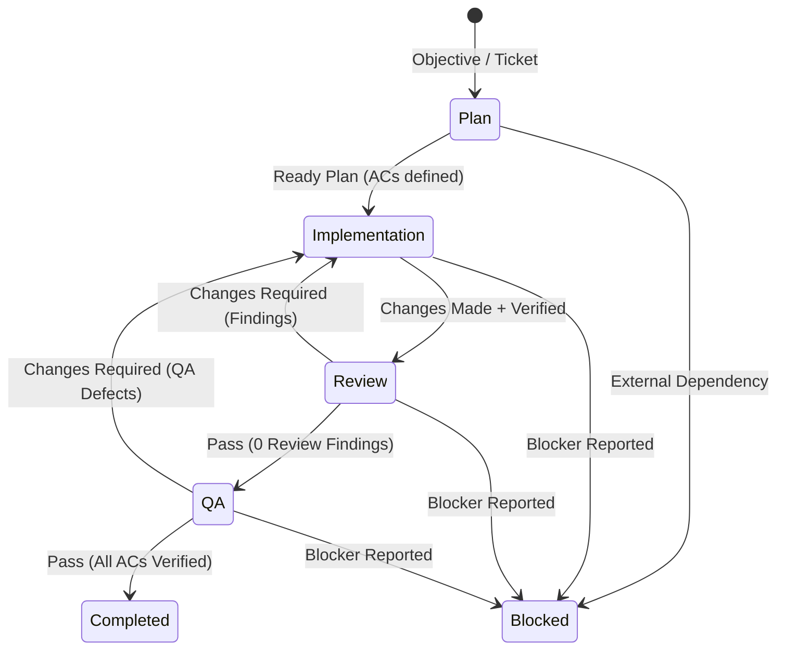

# AOP Software Delivery Plugin for DeepSeek Harness

[](https://github.com/get-aop/aop-plugin)
[](LICENSE)
[](https://getaop.com)

**@get-aop/aop-plugin** is a software delivery workflow plugin for [DeepSeek Harness](https://github.com/deepseek-ai/deepseek-harness) and [Cordis](https://cordis.moe). It automates the multi-agent software engineering lifecycle:

$$\text{Plan} \longrightarrow \text{Implementation} \longleftrightarrow \text{Review} \longleftrightarrow \text{Browser QA}$$

Each role runs with independent context, specific model/thinking profiles, tailored toolsets, and rigid evaluator gates.

---

## Key Features

- **Evaluator-Gated Ping-Pong**: Adversarial code reviewer and independent browser QA engineer reject flawed implementations. Any reported finding forces an implementation pass with an exact disposition requirement.
- **Review Precedes QA**: Any code modification must pass code review with 0 findings before Browser QA can execute.
- **Mandatory Retesting**: QA tracks every prior defect ID and verifies observable resolution before certification.
- **Verified Browser QA**: Browser QA requires real navigation to the QA target (the given `qaUrl`, or one it discovers and declares itself) followed by post-navigation browser interaction and snapshot evidence. Evidence is pinned to the declared target — navigation and observed evidence must settle against exactly that URL.
- **Model Routing**: Configure distinct models/providers per stage:
  - **Plan**: `sol-xhigh` (deep reasoning architecture)
  - **Implementation**: `deepseek-v4-flash-max` (fast, focused coding writer)
  - **Review**: `fable-5-max` (adversarial code review)
  - **Browser QA**: `sol-medium` (browser and UI verification)
- **Safe Isolation**: Evaluators are strictly limited to `read` tools. Only the implementation role possesses workspace `write` access.

---

## State Machine Workflow



---

## Installation & Configuration

### 1. Install

Add `@get-aop/aop-plugin` to your DeepSeek Harness environment:

```bash
pnpm add @get-aop/aop-plugin
```

### 2. Configure in `cordis.yml`

Mount the plugin in your `cordis.yml` profile or overlay:

```yaml
- id: aop-delivery
  name: '@get-aop/aop-plugin'
  config:
    subagentProvider: spawn
    maxCycles: 8
    maxFindings: 64
    maxArtifactChars: 32768
    maxResultChars: 262144
    runTimeoutMs: 3600000
    phaseTimeoutMs: 1800000
    roles:
      plan:
        provider: deepseek
        model: sol-xhigh
        tools:
          - name: read
            access: read
          - name: grep
            access: read
          - name: glob
            access: read

      implementation:
        provider: deepseek
        model: deepseek-v4-flash-max
        toolPresentation: native
        tools:
          - name: read
            access: read
          - name: write
            access: write
          - name: edit
            access: write
          - name: bash
            access: write
          - name: grep
            access: read
          - name: glob
            access: read

      review:
        provider: deepseek
        model: fable-5-max
        tools:
          - name: read
            access: read
          - name: grep
            access: read
          - name: glob
            access: read

      qa:
        provider: deepseek
        model: sol-medium
        tools:
          - name: read
            access: read
          - name: browser_navigate
            access: read
            browserNavigation: true
          - name: browser_snapshot
            access: read
            browserEvidence: true
          - name: browser_click
            access: read
            browserEvidence: true
          - name: browser_fill
            access: read
            browserEvidence: true
```

---

## Tool API

### `aop_delivery` (or `delivery_workflow`)

Invoked by an agent or user to execute the complete delivery lifecycle:

| Parameter | Type | Required | Description |
| :--- | :--- | :--- | :--- |
| `objective` | `string` | **Yes** | The complete implementation objective or ticket. |
| `qaUrl` | `string` | No | Absolute HTTP(S) target URL for browser QA. When omitted, QA discovers the deliverable itself — it inspects the workspace (package.json scripts, README, plan acceptance criteria) to find how the app runs and which URL it serves, and declares it in the QA artifact's `discoveredUrl`. Browser evidence is always pinned to one concrete target (given or discovered). |
| `qaInstructions` | `string` | No | Concrete browser behaviors, interactions, and expected outcomes. When omitted, QA derives them from the plan's acceptance criteria and reports them under `QA-INSTRUCTIONS`. |
| `maxCycles` | `number` | No | Optional implementation-pass ceiling (bounded by deployment policy). |

> **Preflight model check**: before the workflow starts, every role's `provider`/`model` route is verified against the deployment's model catalog. A missing provider or model fails the tool call immediately with the available models listed, instead of surfacing later as an opaque "child failed".


Wall-clock guards: `runTimeoutMs` cancels the whole run; `phaseTimeoutMs` cancels the current phase (Plan/Implementation/Review/QA) via the `workflow/phase` event stream.

> **Discovery-mode trust boundary**: when `qaUrl` is omitted, the target is *declared by the QA model* in the artifact's `discoveredUrl`. The workflow enforces that navigation and evidence are pinned to exactly that declared URL (no navigation elsewhere can certify evidence), but it cannot verify that the declared URL is genuinely the deliverable — target *authenticity* is trusted to the QA model. For strict environments, always pass an explicit `qaUrl`.

---

## About AOP

**Agents Operating Platform (AOP)** is a local-first orchestrator for autonomous coding agents.

- **Website**: [getaop.com](https://getaop.com)
- **GitHub**: [github.com/get-aop](https://github.com/get-aop)

## License

[MIT](LICENSE) © AOP contributors
